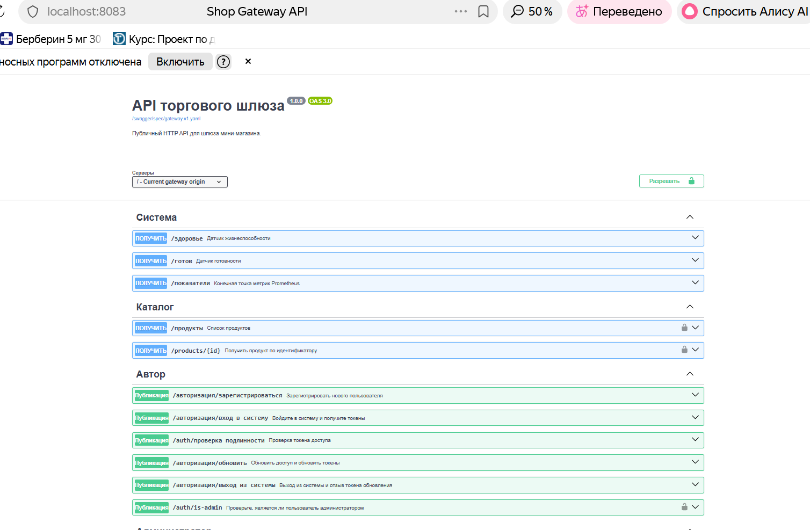
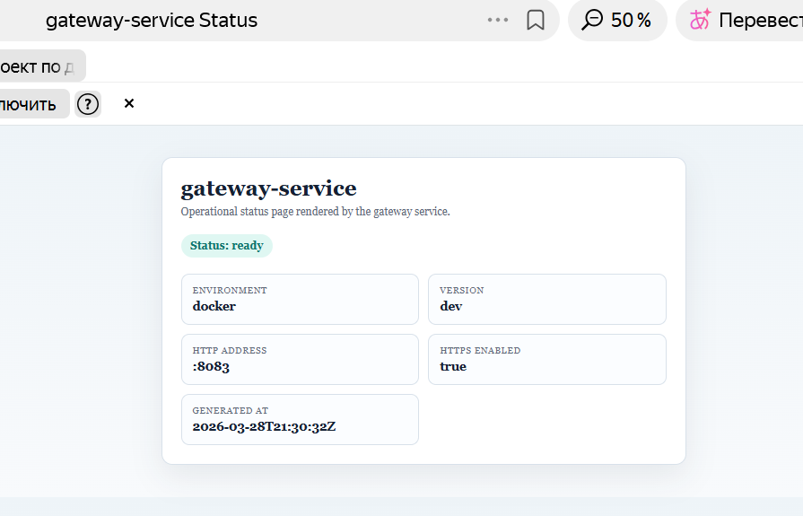

# Homework Report: REST, Middleware, Swagger, Templates, Streaming

Этот отчет оформлен под домашнее задание про HTTP API, middleware, Swagger, шаблонизатор и gRPC streaming.

## Как читать этот отчет

Чтобы проверяющему было проще ориентироваться, для каждого пункта ниже есть:

1. что именно было сделано;
2. где это искать в коде;
3. как это проверить руками.

## 1. Цель домашнего задания

Требовалось:

1. настроить RESTful приложение на роутере;
2. ограничить доступ к закрытым разделам через middleware;
3. подключить Swagger с корректным тестированием запросов;
4. расширить интеграционное тестирование API;
5. добавить статусную HTML-страницу через шаблонизатор;
6. настроить gRPC streaming для отдельных микросервисов;
7. оформить результат в markdown и скриншотах.

## 2. Итоговая схема решения

```text
Client
  -> HTTPS / JSON / SSE
shop-gateway
  -> gRPC -> shop-proxy -> shop-catalog-service
  -> gRPC mTLS -> shop-auth
```

Что важно в этой схеме:

1. `shop-gateway` является внешней HTTP-точкой входа;
2. `shop-catalog-service` отдает unary и server-streaming gRPC;
3. `shop-gateway` адаптирует внутренний gRPC stream во внешний SSE endpoint;
4. `shop-auth` отвечает за JWT-based auth flow, а `shop-gateway` применяет его через middleware.
5. Для задания со звездочкой между `shop-gateway` и `shop-catalog-service` добавлен отдельный `shop-proxy`, который прозрачно проксирует gRPC/TCP-трафик, считает байты в обе стороны и позволяет вносить управляемую задержку.

## 3. Что реализовано по требованиям

### 3.1 RESTful приложение на роутере

Что сделано:

1. Внешнее HTTP API собрано в `shop-gateway`.
2. Используется стандартный `http.ServeMux`.
3. Роутер разделяет product endpoints, auth endpoints и operational endpoints.

Основные маршруты:

1. `GET /products`
2. `GET /products/{id}`
3. `GET /products/stream`
4. `POST /auth/register`
5. `POST /auth/login`
6. `POST /auth/validate`
7. `POST /auth/refresh`
8. `POST /auth/logout`
9. `POST /auth/is-admin`
10. `GET /health`
11. `GET /ready`
12. `GET /metrics`
13. `GET/POST /admin/log-level`
14. `GET /status`
15. `GET /swagger/`

Где смотреть в коде:

1. `shop-gateway/internal/transport/http/v1/router.go` — регистрация HTTP маршрутов.
2. `shop-gateway/internal/transport/http/v1/handlers/products.go` — product handlers.
3. `shop-gateway/internal/transport/http/v1/handlers/auth.go` — auth handlers.
4. `shop-gateway/internal/transport/http/v1/handlers/health.go` — health/ready handlers.
5. `shop-gateway/internal/transport/http/v1/handlers/admin.go` — log-level handler.

Что получилось:

1. `shop-gateway` выступает единым HTTP API фасадом;
2. product API поддерживает и обычные JSON-ответы, и потоковую SSE-выдачу;
3. маршруты читаются и проверяются отдельно, без смешивания бизнес-логики и bootstrap-кода.

### 3.2 Middleware для закрытых разделов

Что сделано:

1. В `shop-gateway` реализован auth middleware.
2. Middleware читает `Authorization: Bearer <token>`.
3. Middleware читает `X-App-Id`.
4. Middleware вызывает `ValidateToken(...)` через `shop-auth`.
5. Только после успешной проверки запрос передается в закрытые handlers.

Protected routes:

1. `GET /products`
2. `GET /products/{id}`
3. `GET /products/stream`
4. `POST /auth/is-admin`

Где смотреть в коде:

1. `shop-gateway/internal/transport/http/v1/middleware/auth.go` — сама middleware.
2. `shop-gateway/internal/transport/http/v1/router.go` — где middleware навешивается на закрытые маршруты.
3. `shop-gateway/internal/service/gateway/gateway.go` — вызовы auth service со стороны gateway service.
4. `shop-gateway/internal/adapters/auth_grpc/repository.go` — адаптер к `shop-auth`.

Что получилось:

1. контроль доступа вынесен в отдельный cross-cutting слой;
2. handler-ы не дублируют auth-валидацию вручную;
3. негативные сценарии без токена и без `X-App-Id` проверяются отдельно.

### 3.3 Swagger / OpenAPI

Что сделано:

1. Для `shop-gateway` подготовлен OpenAPI-контракт.
2. Root spec раздается из gateway.
3. Swagger UI открыт через HTTP endpoint.
4. Split-файлы OpenAPI доступны через статическую раздачу каталога spec.
5. Защищенные routes описаны с bearer auth и `X-App-Id`.

Где смотреть в коде:

1. `shop-gateway/openapi/gateway.v1.yaml` — root OpenAPI spec.
2. `shop-gateway/openapi/gateway.v1/paths/` — split path definitions.
3. `shop-gateway/internal/transport/http/v1/handlers/swagger.go` — handler для Swagger UI.
4. `shop-gateway/web/swagger/index.html` — HTML Swagger UI.
5. `shop-gateway/internal/transport/http/v1/router.go` — `/swagger/` и `/swagger/spec/...`.

Как это доступно:

1. `GET /swagger/` — Swagger UI
2. `GET /swagger/spec/gateway.v1.yaml` — root OpenAPI spec

Что получилось:

1. API описан как контракт, а не только как набор handlers;
2. Swagger UI реально использует текущий spec;
3. запросы можно тестировать из браузера, а не только через `curl`.



### 3.4 Интеграционное тестирование API

Что сделано на текущем этапе:

1. Выполнен полный ручной smoke-check сценариев через `curl` и Swagger.
2. Проверен auth flow: `register -> login -> validate`.
3. Проверен protected `GET /products` с токеном.
4. Проверены негативные сценарии без токена и без `X-App-Id`.
5. Проверен `GET /products/stream` через SSE.

Где смотреть в коде:

1. `shop-gateway/internal/transport/http/v1/handlers/products.go` — JSON и SSE product endpoints.
2. `shop-gateway/internal/transport/http/v1/middleware/auth.go` — ограничения доступа.
3. `shop-gateway/issues.md` — ниже в этом отчете описан текстовый protocol smoke-check.

Честный статус:

1. ручной integration/smoke protocol уже оформлен и воспроизводим;
2. автоматизированные расширенные integration tests для HTTP API остаются следующим логичным улучшением.

### 3.5 Статусная страница через шаблонизатор

Что сделано:

1. В `shop-gateway` добавлен HTML endpoint `GET /status`.
2. Страница рендерится через `html/template`.
3. Шаблон получает runtime-данные из Go handler-а.
4. Страница показывает:
   - service name;
   - environment;
   - version;
   - HTTP address;
   - включен ли HTTPS;
   - текущий status;
   - время генерации страницы.

Где смотреть в коде:

1. `shop-gateway/internal/transport/http/v1/handlers/status.go` — status handler.
2. `shop-gateway/web/status/index.html` — HTML template.
3. `shop-gateway/internal/app/app.go` — создание и подключение `StatusHandler`.
4. `shop-gateway/internal/transport/http/v1/router.go` — route `/status`.

Что получилось:

1. у сервиса появился отдельный человекочитаемый operational endpoint;
2. шаблонизатор используется осознанно, а не как статическая HTML-заглушка.



### 3.6 gRPC streaming + адаптация в SSE

Что сделано:

1. В `shop-catalog-service` сохранены unary методы `ListProducts` и `GetProduct`.
2. Добавлен новый gRPC RPC `StreamProducts`.
3. `shop-catalog-service` отдает товары по одному элементу через server streaming.
4. `shop-gateway` открывает внутренний gRPC stream.
5. `shop-gateway` адаптирует его во внешний SSE endpoint `GET /products/stream`.

Где смотреть в коде:

1. `shop-contracts/proto/catalog/v1/catalog.proto` — описание RPC `StreamProducts`.
2. `shop-catalog-service/internal/transport/grpc/v1/handlers/handler.go` — server-side реализация streaming RPC.
3. `shop-catalog-service/cmd/catalog-client/main.go` — отдельный клиент для ручной проверки gRPC stream.
4. `shop-gateway/internal/client/grpc/catalog/client.go` — открытие gRPC stream из gateway.
5. `shop-gateway/internal/adapters/catalog_grpc/repository.go` — адаптация protobuf stream в внутренний `ProductStream`.
6. `shop-gateway/internal/service/gateway/ports.go` — внутренний streaming contract `ProductStream`.
7. `shop-gateway/internal/service/gateway/gateway.go` — service method `StreamProducts(...)`.
8. `shop-gateway/internal/transport/http/v1/contracts/ports.go` — transport contract для streaming product service.
9. `shop-gateway/internal/transport/http/v1/handlers/products.go` — SSE endpoint `GET /products/stream`.
10. `shop-gateway/internal/transport/http/v1/router.go` — регистрация `/products/stream`.

Что получилось:

1. показан server-streaming gRPC в отдельном микросервисе;
2. показана адаптация внутреннего gRPC streaming во внешний HTTP streaming;
3. в проекте появился production-like паттерн: внешний HTTP/SSE и внутренний gRPC streaming.

### 3.7 Задание со звездочкой: proxy-service

Что сделано:

1. Добавлен отдельный сервис `shop-proxy`.
2. `shop-proxy` встроен в маршрут `shop-gateway -> shop-proxy -> shop-catalog-service`.
3. Сервис поднимает два порта:
   - `:9095` для прозрачного TCP/gRPC proxy;
   - `:8085` для admin/metrics HTTP API.
4. Proxy считает:
   - общее количество TCP соединений;
   - количество активных соединений;
   - байты `client -> upstream`;
   - байты `upstream -> client`;
   - ошибки copy loop.
5. Для proxy добавлен fault injection через управляемый `delay`.
6. Для admin endpoints добавлена отдельная auth middleware:
   - читает `Authorization: Bearer <token>`;
   - читает `X-App-Id`;
   - валидирует токен через `shop-auth`;
   - дополнительно проверяет `IsAdmin`.
7. `shop-proxy` подключен в `docker-compose`, а Prometheus скрейпит его `/metrics`.

Где смотреть в коде:

1. `shop-proxy/internal/app/tcp/app.go` — TCP proxy runtime, copy loop, delay, traffic metrics.
2. `shop-proxy/internal/observability/metrics.go` — proxy-метрики (`proxy_tcp_connections_*`, `proxy_traffic_bytes_*`, `proxy_faults_delay_milliseconds`).
3. `shop-proxy/internal/transport/http/router.go` — public/admin HTTP routes.
4. `shop-proxy/internal/transport/http/handlers/admins.go` — `GET /admin/state`, `POST /admin/faults/delay`, `POST /admin/reset`.
5. `shop-proxy/internal/transport/http/middleware/auth.go` — admin auth middleware.
6. `shop-proxy/internal/client/grpc/auth/client.go` — gRPC client к `shop-auth`.
7. `shop-proxy/internal/adapters/auth_grpc/repository.go` — адаптер auth-контракта для middleware.
8. `shop-proxy/config/config.docker.yaml` — docker-конфиг proxy-service.
9. `shop-platform/deploy/docker-compose.yml` — подключение `proxy-service` в compose-стенд.
10. `shop-platform/infra/prometheus/prometheus.yml` — scrape target для proxy-service.
11. `shop-gateway/config/config.docker.yaml` — перевод gateway на `proxy-service:9095`.

Что получилось:

1. Задание со звездочкой выполнено отдельным микросервисом, а не встроено в существующий сервис скрыто.
2. Трафик между `shop-gateway` и `shop-catalog-service` теперь наблюдаем на уровне байтов и соединений.
3. Через admin API можно управляемо ухудшать канал и демонстрировать влияние на `GET /products` и `GET /products/stream`.
4. В проекте появился еще один production-like паттерн: отдельный network proxy с observability и fault injection.

## 4. Что пока остается улучшить

На момент оформления отчета еще не закрыты до конца два пункта:

1. автоматизированные расширенные integration tests для HTTP API;
2. отдельный оформленный блок сравнения `HTTP+JSON vs gRPC`;

Задание со звездочкой про proxy-service уже реализовано и встроено в compose-стенд.

## 5. Пошаговая инструкция проверки

### 5.1 Поднять окружение

```bash
cd shop-platform/deploy
docker compose up -d --build
docker compose ps
```

### 5.2 Проверить gateway

```bash
curl -k https://localhost:8083/health
curl -k https://localhost:8083/ready
curl -k https://localhost:8083/status
curl -k https://localhost:8083/swagger/
```

### 5.3 Проверить auth flow

Register:

```bash
curl -k -X POST https://localhost:8083/auth/register \
  -H "Content-Type: application/json" \
  -d '{"username":"demo","email":"demo@example.com","password":"Test123!"}'
```

Login:

```bash
curl -k -X POST https://localhost:8083/auth/login \
  -H "Content-Type: application/json" \
  -d '{"email_or_name":"demo","password":"Test123!","app_id":1,"device_id":"dev-1"}'
```

Validate:

```bash
curl -k -X POST https://localhost:8083/auth/validate \
  -H "Content-Type: application/json" \
  -d '{"token":"<access_token>","app_id":1}'
```

### 5.4 Проверить protected product API

```bash
curl -k "https://localhost:8083/products?limit=3&offset=0" \
  -H "Authorization: Bearer <access_token>" \
  -H "X-App-Id: 1"
```

### 5.5 Проверить SSE endpoint

```bash
curl -N -k "https://localhost:8083/products/stream?limit=3&offset=0" \
  -H "Authorization: Bearer <access_token>" \
  -H "X-App-Id: 1"
```

Ожидаемый результат:

1. приходят несколько `event: product`;
2. в конце приходит `event: end`.

### 5.6 Отдельно проверить gRPC stream в catalog-service

Проверка отдельным клиентом:

```bash
cd shop-catalog-service
go run ./cmd/catalog-client
```

Ожидаемый результат:

1. клиент успешно вызывает unary методы;
2. клиент получает элементы из `StreamProducts` по одному;
3. в конце stream корректно завершается.

### 5.7 Проверить proxy-service

Проверка health/metrics:

```bash
curl http://localhost:8085/health
curl http://localhost:8085/ready
curl http://localhost:8085/metrics
```

Проверка admin state:

```bash
curl -H "Authorization: Bearer <access_token>" \
  -H "X-App-Id: 1" \
  http://localhost:8085/admin/state
```

Включить задержку:

```bash
curl -X POST -H "Authorization: Bearer <access_token>" \
  -H "X-App-Id: 1" \
  "http://localhost:8085/admin/faults/delay?ms=500"
```

Сбросить задержку:

```bash
curl -X POST -H "Authorization: Bearer <access_token>" \
  -H "X-App-Id: 1" \
  http://localhost:8085/admin/reset
```

Ожидаемый результат:

1. admin routes недоступны без токена или без admin-role;
2. `delay_ms` меняется через admin API;
3. в `/metrics` видны `proxy_tcp_connections_total`, `proxy_traffic_bytes_upstream_total`, `proxy_traffic_bytes_downstream_total`;
4. при включенном `delay` ответы gateway на product endpoints становятся заметно медленнее.

## 6. Текстовый протокол проверок

Фактический сценарий smoke-check:

1. Поднят compose-стенд.
2. Проверены `health` и `ready`.
3. Проверен HTML `/status`.
4. Проверен Swagger UI.
5. Выполнены `register`, `login`, `validate`.
6. Проверен protected `GET /products`.
7. Проверены негативные сценарии без токена и без `X-App-Id`.
8. Проверен `GET /products/stream` через SSE.
9. Отдельно проверен gRPC server streaming на стороне `shop-catalog-service`.
10. Проверен `shop-proxy`: health, metrics, admin state, включение и сброс `delay`.

## 7. Куда приложить скриншоты

Скриншоты лучше хранить прямо рядом с этим отчетом, в каталоге:

1. `shop-gateway/images/`

Я добавил эту директорию как рекомендуемое место для всех PNG по текущей ДЗ.

Если вставлять их в этот markdown, используй относительные пути вида:

```md

```

### Рекомендуемые имена файлов

Минимальный комплект:

1. `images/01-compose-healthy.png` — `docker compose ps`
2. `images/02-gateway-ready.png` — `health` / `ready`
3. `images/03-status-page.png` — страница `/status`
4. `images/04-swagger-ui.png` — Swagger UI
5. `images/05-login-response.png` — успешный `login`
6. `images/06-products-protected.png` — protected `GET /products`
7. `images/07-products-stream-sse.png` — SSE поток `/products/stream`
8. `images/08-catalog-stream-client.png` — gRPC stream в `catalog-client`

Для задания со звездочкой:

1. `images/09-proxy-metrics.png` — `/metrics` proxy-service
2. `images/10-proxy-admin-state.png` — `GET /admin/state`
3. `images/11-proxy-delay-set.png` — `POST /admin/faults/delay?ms=500`
4. `images/12-proxy-delay-reset.png` — `POST /admin/reset`

Если хочешь усилить отчет, можно добавить еще:

1. `images/13-products-no-token.png` — отказ без токена
2. `images/14-products-no-app-id.png` — отказ без `X-App-Id`
3. `images/15-swagger-authorize.png` — окно `Authorize` в Swagger
4. `images/16-openapi-spec.png` — загрузка spec через `/swagger/spec/gateway.v1.yaml`

## 8. Самооценка результата

Что получилось хорошо:

1. `shop-gateway` теперь выступает не только как CRUD HTTP facade, но и как протокольный адаптер;
2. middleware, Swagger, status page и streaming собраны в единую архитектуру;
3. внутри системы показан production-like паттерн: внешний HTTP + внутренний gRPC;
4. отдельно продемонстрирована адаптация `gRPC stream -> SSE`.
5. Задание со звездочкой реализовано отдельным `shop-proxy`, который добавляет network-level observability и fault injection без изменения бизнес-логики `shop-gateway` и `shop-catalog-service`.

Что еще стоит улучшить:

1. добавить автоматизированные integration tests на HTTP API;
2. оформить сравнение `HTTP+JSON vs gRPC` отдельным разделом с замерами;
3. при необходимости расширить `shop-proxy` новыми видами fault injection, например bandwidth limit или jitter.
